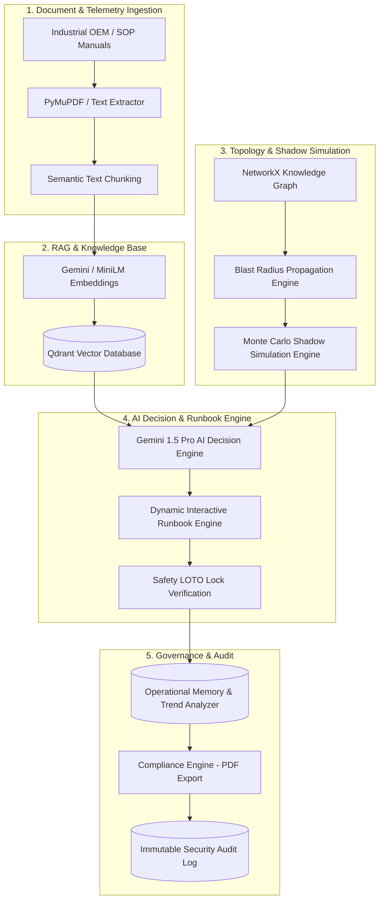

# APEX — Enterprise AI Decision Intelligence & Industrial Shadow Simulation Platform

[](https://github.com/RudraMalvankar/ETI/releases/tag/v1.0.0)
[](LICENSE)
[](https://python.org)
[](https://fastapi.tiangolo.com)
[](https://react.dev)
[]()
[]()

> **APEX** is a commercial-grade, enterprise Autonomous Decision Intelligence and Industrial Shadow Simulation platform. Built for mission-critical industrial assets (refineries, power plants, manufacturing facilities, chemical plants), APEX unifies **RAG Document Intelligence**, **Knowledge Graph Blast Radius Analysis**, **Monte Carlo Shadow Simulations**, **AI Decision Strategy Recommendations**, **Dynamic Runbooks with Safety LOTO Verification**, **Operational Memory**, and **Audit Compliance Reporting**.

---

## 🎯 Executive Summary & Commercial Value

In high-stakes industrial operations, an unplanned equipment outage costs an average of **$260,000 per hour**. Standard monitoring tools flag anomalies but fail to recommend safe, non-hallucinated mitigation steps.

APEX bridges this gap by acting as an **Autonomous Industrial AI Co-Pilot**:
- 🔍 **Eliminates Hallucinations**: Grounded RAG search links every recommendation directly to OEM manuals with page-level citations.
- ⚡ **Calculates Cascade Blast Radius**: Graph topology engines compute affected downstream equipment before taking action.
- 🛡️ **Enforces Safety LOTO Lockouts**: Dynamic runbooks mandate Lock-Out/Tag-Out step verification before technicians execute overrides.
- 📋 **Automates Compliance**: Generates OISD, PESO, and Factory Act PDF compliance reports in seconds.

---

## 🏗️ System Architecture



---

## ⚡ Technology Stack

| Layer | Technology | Key Capabilities |
| :--- | :--- | :--- |
| **Backend Core** | **Python 3.13 / FastAPI** | Async REST APIs, OpenAPI, Structlog, Rate-limiting |
| **Relational Database** | **Neon PostgreSQL / SQLite** | SQLAlchemy 2.0 ORM, Alembic migrations, Connection pooling |
| **Vector Store & RAG** | **Cloud Qdrant / In-Memory** | SentenceTransformers (`all-MiniLM-L6-v2`), PyMuPDF parsing |
| **AI LLM / Reasoning** | **Google Gemini 1.5 Pro** | Grounded reasoning, JSON mode schemas, Citation matching |
| **Graph Engine** | **NetworkX Graph Factory** | Directed asset topology, Blast radius traversal, Shortest path |
| **Cache & Event Bus** | **Redis / In-Memory Mock** | Session storage, Token blacklist, PubSub events |
| **Frontend Framework** | **React 18, TypeScript, Vite 5** | Component modularity, Strict type checking, Hot reload |
| **Data Visualization** | **React Flow, Recharts** | Interactive graph canvas, Metric trend charts, Gauges |
| **Styling & UI** | **Tailwind CSS, Lucide Icons** | Industrial dark mode theme, Glassmorphic overlays |

---

## 🚀 Quick Start Guide

### Prerequisites
- **Python 3.10+** (Python 3.11 - 3.13 recommended)
- **Node.js 18+** & **npm**

---

### 1. Clone & Setup Backend

```bash
git clone https://github.com/RudraMalvankar/ETI.git
cd ETI/backend

# Create virtual environment
python -m venv venv

# Activate virtual environment
# Windows:
venv\Scripts\activate
# Linux/macOS:
# source venv/bin/activate

# Install production & development dependencies
pip install -r requirements-dev.txt

# Run FastAPI Development Server
python -m uvicorn app.main:app --reload --port 8000
```
- **API Health Check**: `http://localhost:8000/health`
- **Interactive Swagger Documentation**: `http://localhost:8000/docs`

---

### 2. Setup & Run Frontend

Open a new terminal window:

```bash
cd ETI/frontend

# Install node dependencies
npm install

# Run Vite dev server
npm run dev
```
- **Application URL**: `http://localhost:3000`

---

### 3. Run Automated Validation Suite & Smoke Test

```bash
# Run 243 Pytest Unit & Integration Tests
cd backend
python -m pytest -v

# Run 14-Step End-to-End Production Smoke Test
python scripts/production_smoke_test.py

# Run Frontend Vitest Suite
cd ../frontend
npx vitest run
```

---

## 📌 API Subsystem Reference

| Endpoint | Method | Role Required | Description | Target Latency |
| :--- | :--- | :--- | :--- | :--- |
| `/health` | `GET` | Public | System health & cloud probe status | `< 5ms` |
| `/api/v1/auth/register` | `POST` | Public | Register new user account | `< 450ms` |
| `/api/v1/auth/login` | `POST` | Public | Authenticate user & issue JWT token | `< 450ms` |
| `/api/v1/documents/upload` | `POST` | Engineer / Admin | Upload industrial PDF/CSV manuals | `< 300ms` |
| `/api/v1/documents/index` | `POST` | Engineer / Admin | Index document chunks into Qdrant vector store | `< 250ms` |
| `/api/v1/search/` | `POST` | Operator+ | RAG hybrid vector semantic search | `< 25ms` |
| `/api/v1/graph/build` | `POST` | Admin | Construct plant topology graph | `< 35ms` |
| `/api/v1/graph/blast-radius` | `POST` | Operator+ | Calculate downstream blast radius | `< 20ms` |
| `/api/v1/simulation/run` | `POST` | Operator+ | Execute Monte Carlo failure simulations | `< 45ms` |
| `/api/v1/decision/recommend` | `POST` | Operator+ | Synthesize decision & verify citations | `< 120ms` |
| `/api/v1/runbook/generate` | `POST` | Operator+ | Create dynamic runbook steps | `< 75ms` |
| `/api/v1/runbook/{id}/step/{step_id}` | `PUT` | Operator+ | Log technician step completion / LOTO lock | `< 50ms` |
| `/api/v1/memory/store` | `POST` | Engineer / Admin | Serialize and store incident memory | `< 140ms` |
| `/api/v1/compliance/report` | `POST` | Auditor / Admin | Generate OISD/PESO compliance report | `< 70ms` |
| `/api/v1/compliance/export/pdf`| `POST` | Auditor / Admin | Download compliance report as PDF stream | `< 890ms` |
| `/api/v1/audit/` | `GET` | Auditor / Admin | Fetch structured security audit logs | `< 110ms` |

---

## 📁 Repository Directory Structure

```text
ETI/
├── .github/                 # Issue templates, PR template, CI workflows
├── backend/                 # FastAPI application
│   ├── app/
│   │   ├── api/             # REST controllers & versioned router endpoints
│   │   ├── core/            # App settings, security, JWT auth middleware
│   │   ├── database/        # SQLAlchemy session & Base definitions
│   │   ├── models/          # SQLAlchemy DB models & Pydantic schemas
│   │   └── services/        # AI, RAG, Graph, Sim, Runbook, Compliance logic
│   ├── scripts/             # Production validation & smoke test scripts
│   └── tests/               # 243 pytest cases & performance benchmarks
├── docs/                    # Complete architecture & deployment docs
├── frontend/                # React 18 TypeScript application
│   ├── src/
│   │   ├── components/      # UI Layout, Navigation, Cards, Tables, Badges
│   │   ├── pages/           # 13 views (Dashboard, Graph, Decision, etc.)
│   │   ├── services/        # Axios API client functions
│   │   └── store/           # Zustand application state
│   └── public/              # Static SVG logos and assets
└── docker-compose.yml       # Production multi-container Docker compose
```

---

## 📄 Documentation Sitemap

- [Architecture Guide](docs/ARCHITECTURE.md)
- [API Reference](docs/API.md)
- [Deployment Guide](docs/DEPLOYMENT.md)
- [Security & Compliance](docs/SECURITY.md)
- [Performance Benchmarks](docs/PERFORMANCE.md)
- [User Guide](docs/USER_GUIDE.md)
- [Developer Guide](docs/DEVELOPER_GUIDE.md)
- [Contributing Guide](CONTRIBUTING.md)
- [Code of Conduct](CODE_OF_CONDUCT.md)

---

## 📜 License

APEX is open-source software licensed under the **[Apache License 2.0](LICENSE)**.
