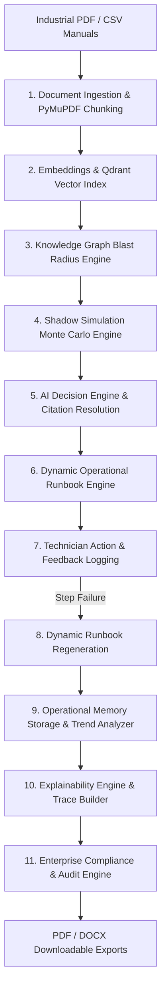

# APEX - Autonomous Decision Intelligence & Shadow Simulation Platform

[](https://github.com/RudraMalvankar/ETI)
[](c:\Users\mypc\Desktop\ETI\backend)
[](c:\Users\mypc\Desktop\ETI\frontend)
[]()

> **APEX** is an enterprise-grade Autonomous Decision Intelligence platform for mission-critical industrial assets. It combines **RAG Document Intelligence (Qdrant Vector Index)**, **Knowledge Graph Topology (Blast Radius Analysis)**, **Shadow Simulation (Monte Carlo Failure Models)**, **Deterministic AI Decisions**, **Dynamic Runbooks**, **Operational Memory**, **Explainability**, and **Enterprise Compliance Reporting**.

---

## 🏗️ System Architecture



---

## ⚡ Technology Stack

### Backend
- **Core Framework**: Python 3.13 / FastAPI / Pydantic v2 / Uvicorn
- **Document Processing**: PyMuPDF (`fitz`), ReportLab
- **Vector Search & RAG**: Qdrant Vector Store, SentenceTransformers (`all-MiniLM-L6-v2`)
- **Knowledge Graph**: NetworkX Graph Factory
- **Simulation**: Custom Monte Carlo Shadow Simulation Engine
- **Testing**: Pytest, FastAPI TestClient

### Frontend
- **Framework**: React 18, TypeScript, Vite 5
- **Styling & Icons**: Tailwind CSS, Lucide Icons
- **Interactive Visualization**: React Flow (Knowledge Graph Canvas), Recharts (Financial & Downtime Analytics)
- **State Management & Querying**: Zustand, Axios

---

## 🚀 Quick Start Guide

### Prerequisites
- **Python 3.10+** (Virtual environment located in `backend/venv`)
- **Node.js 18+** & **npm**

---

### 1. Start the FastAPI Backend Server
```bash
cd backend
.\venv\Scripts\uvicorn app.main:app --reload --port 8000
```
- **API Health Check**: `http://localhost:8000/health`
- **Interactive OpenAPI Documentation**: `http://localhost:8000/docs`

---

### 2. Start the Frontend Dashboard
Open a new terminal window:
```bash
cd frontend
npm run dev
```
- **Dashboard URL**: `http://localhost:3000`

---

### 3. Run Backend Automated Test Suite & E2E Lifecycle Demo

```bash
# Automated Pytest Suite
cd backend
.\venv\Scripts\python.exe -m pytest tests/

# Full 13-Stage E2E Lifecycle Demonstration Script
cd backend
.\venv\Scripts\python.exe scripts/test_memory_compliance.py
```

---

## 📌 API Overview

| Endpoint | Method | Description | Target Latency |
| :--- | :--- | :--- | :--- |
| `/api/v1/documents/upload` | `POST` | Ingest industrial PDF/CSV manuals | `< 500ms` |
| `/api/v1/documents/index` | `POST` | Index document chunks into Qdrant vector store | `< 300ms` |
| `/api/v1/search/` | `POST` | Hybrid vector semantic search | `< 50ms` |
| `/api/v1/graph/build` | `POST` | Construct plant topology graph | `< 100ms` |
| `/api/v1/graph/blast-radius/{asset_id}` | `GET` | Calculate downstream blast radius | `< 20ms` |
| `/api/v1/simulation/run` | `POST` | Execute Monte Carlo failure simulations | `< 100ms` |
| `/api/v1/decision/evaluate` | `POST` | Synthesize decision & verify citations | `< 150ms` |
| `/api/v1/runbook/generate` | `POST` | Create dynamic runbook steps | `< 100ms` |
| `/api/v1/runbook/{id}/step/{step_id}` | `PUT` | Log technician step completion or failure | `< 50ms` |
| `/api/v1/runbook/{id}/regenerate` | `POST` | Dynamically regenerate runbook workflow | `< 100ms` |
| `/api/v1/memory/store` | `POST` | Serialize and store incident memory | `< 50ms` |
| `/api/v1/memory/search` | `POST` | Search historical incident memories | `< 100ms` |
| `/api/v1/memory/trends` | `GET` | Calculate organizational failure trends | `< 50ms` |
| `/api/v1/explainability/explain` | `POST` | Build non-hallucinated decision trace summary | `< 200ms` |
| `/api/v1/compliance/report` | `POST` | Generate 11-section compliance audit report | `< 300ms` |
| `/api/v1/compliance/export/pdf` | `POST` | Download compliance report as PDF stream | `< 100ms` |
| `/api/v1/compliance/export/docx` | `POST` | Download compliance report as DOCX stream | `< 100ms` |

---

## 🔒 Known Limitations & Future Roadmap

- **Multi-Tenant Authorization**: Currently single-tenant admin execution mode; RBAC role bindings planned for enterprise cloud release.
- **Live IoT Sensor Telemetry**: Simulated via REST polling; WebSockets/MQTT pipeline integration targeted for Next release.

---

## 📄 License

Internal Enterprise Codebase — Developed for **APEX Enterprise Platform**.
