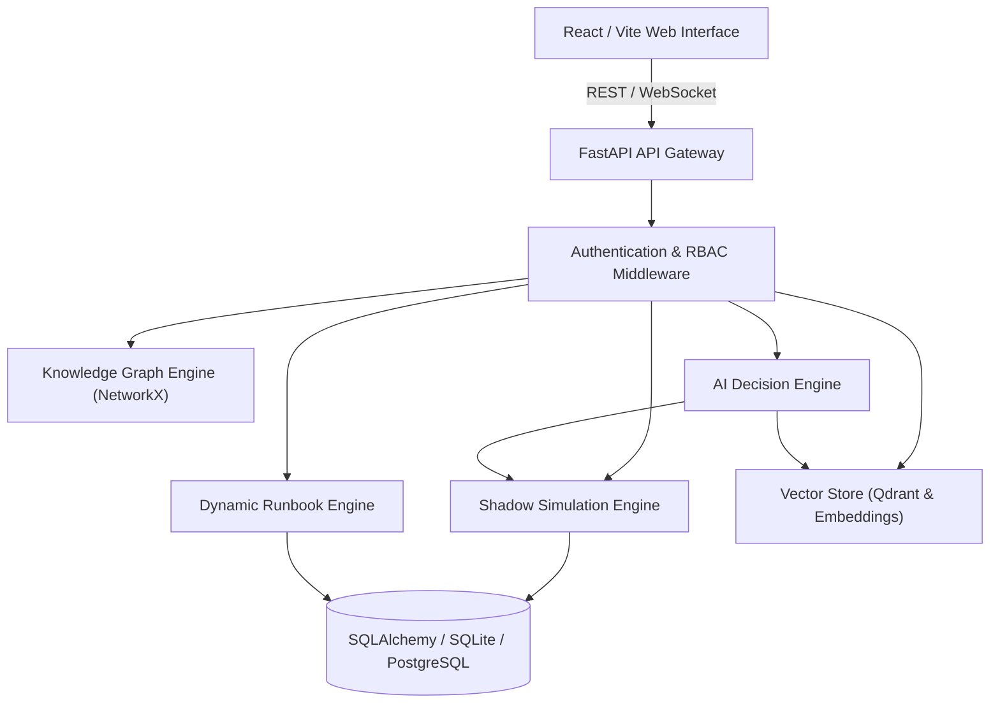

# APEX System Architecture & Design Overview

## Executive Overview

APEX (Autonomous Process Evaluation & eXecution) is a high-availability industrial decision intelligence copilot. It orchestrates real-time Knowledge Graph topology, deterministic Shadow Simulations, RAG document intelligence, dynamic Runbook generation, and Operational Incident Memory.

## Core Subsystems

### 1. Deterministic Knowledge Graph Engine
- Builds directed topological dependency graphs of industrial assets (Pumps, Valves, Compressors, Sensors).
- Calculates multi-hop impact blast-radius propagation and shortest mitigation path traversals.

### 2. Shadow Simulation Engine
- Evaluates operational failure scenarios (Best Case, Expected Case, Worst Case).
- Computes multi-dimensional risk profiles (Safety, Operational, Financial, Environmental).

### 3. AI Decision Engine
- Combines RAG context, topology graphs, and shadow simulation outcomes into structured prompts.
- Employs guardrails with `CitationResolver` to prevent LLM hallucinations.

### 4. Dynamic Runbook Engine
- Translates decision strategies into step-by-step procedures with safety constraints.
- Handles technician feedback loops and automatic step regeneration.

### 5. Vector Store & Retrieval (RAG)
- Uses Qdrant vector database (In-memory or Cloud) with adaptive embedding models.
- Indexes technical manuals, P&ID diagrams, and standard operating procedures (SOPs).
