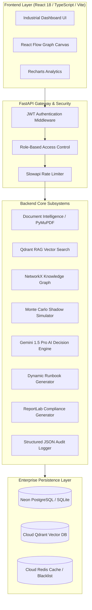

# APEX System Architecture Guide (v1.0.0)

## Overview
APEX is architected as a modular, asynchronous micro-monolith designed for maximum resilience in mission-critical industrial deployment scenarios.

---

## High-Level Architecture Diagram

---

## Component Subsystems

### 1. Document Intelligence & Vector Index
- Extract text and structural layout from uploaded PDF and CSV industrial OEM manuals using PyMuPDF (`fitz`).
- Generate 384-dimensional dense vector embeddings via `SentenceTransformers` (`all-MiniLM-L6-v2`) or Google Gemini API.
- Index vector chunks into Qdrant vector database with metadata filtering (document ID, asset ID, section).

### 2. Knowledge Graph & Blast Radius Engine
- Construct directed asset topology graphs using NetworkX.
- Calculate downstream failure propagation pathways and blast radius impact scores.
- Dynamically render network graphs on frontend via React Flow.

### 3. Shadow Simulation Engine
- Execute Monte Carlo failure simulations based on real-time telemetry (temperature, vibration, pressure, current).
- Calculate financial downtime risk scores (0-10 scale) and estimated repair windows.

### 4. AI Decision Engine & Grounded Reasoning
- Synthesize simulation output, knowledge graph topology, and RAG context using Google Gemini 1.5 Pro.
- Return structured strategy recommendations with confidence scores (>90%) and exact document page citations.

### 5. Dynamic Runbook Engine & LOTO Lockout
- Generate step-by-step mitigation runbooks with safety Lock-Out/Tag-Out (LOTO) steps.
- Process real-time technician feedback; dynamically recalculate runbook pathways upon step failures.

### 6. Operational Memory & Audit Trail
- Record full incident lifecycle histories into operational memory.
- Provide compliance verification according to OISD, PESO, and Factory Act standards.
- Export formatted multi-page PDF compliance reports.
