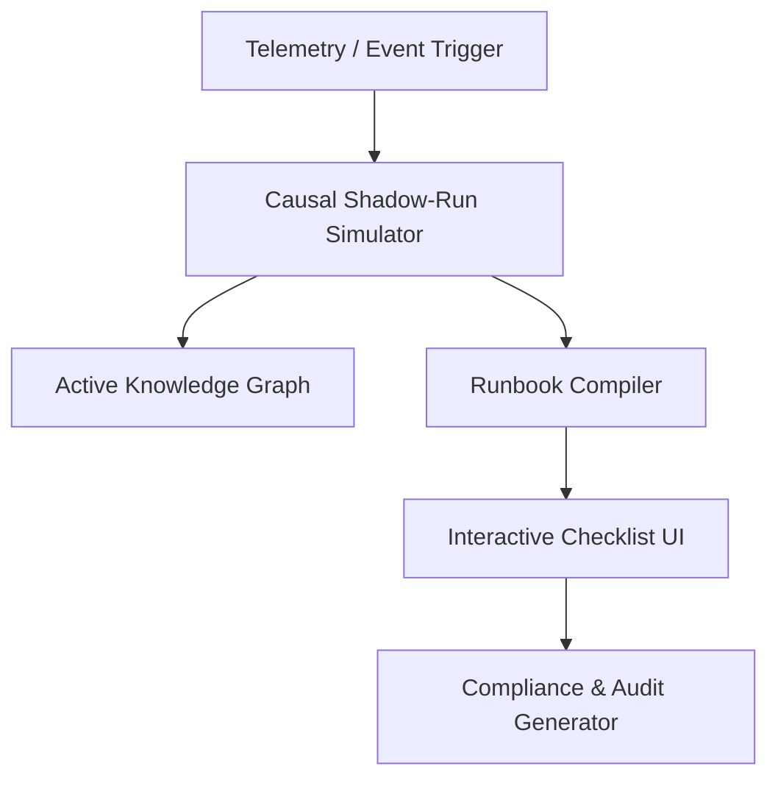

# Implementation Plan: APEX (The Causal Autopilot & Executable Runbook Engine)

## Goal Description
Build **APEX**, an active decision intelligence platform for asset-intensive process plants that moves beyond passive document search (RAG) to active causal simulation and step-by-step executable runbooks. 

To win the hackathon, the prototype will demonstrate:
1. **Interactive Causal Propagation Map**: A visual SVG/Canvas graph tracing failure propagation chains (forward and backward) through assets and sensors.
2. **Generative Executable Runbooks**: Step-by-step action checklists automatically generated from engineering manuals (OEM), SOPs, and compliance logs in response to plant events.
3. **Dual-View UI (Desktop & Rugged Mobile)**: Toggles between a control-room desktop dashboard and a rugged mobile interface for field technicians.
4. **Interactive Ishikawa (Fishbone) & Root Cause Analysis**: Visual diagnostic diagrams for failure tracing.
5. **One-Click Regulatory Evidence Generator**: Automated creation of audit-ready compliance packages (PESO, OISD) signed off directly from completed runbooks.

---

## User Review Required
> [!IMPORTANT]
> **Core Architecture Pivot**: We are shifting the primary interface from a Chatbot to a visual **Anomalies Feed & Executable Runbook checklist**.
> 
> **Technology Stack**: Vite + React + Vanilla CSS (No Tailwind CSS). Graphs and timelines will be rendered using custom interactive React SVG/Canvas structures for high performance and visual premium design.

---

## Proposed System Architecture

---

## Proposed Changes

### [NEW] Frontend Files
We will structure the workspace as a high-fidelity single-page app (SPA).

#### `src/index.css`
A high-contrast industrial dark mode theme:
- Background: `#0B0F17` (Deep obsidian)
- Panels: `#151D2A` (Glassmorphic steel)
- Alarm/Critical: `#EF4444` (Glowing neon red)
- Health/Status: `#10B981` (Vibrant green)
- Accents: `#3B82F6` (Electric cobalt blue)

#### `src/components/CausalGraph.jsx`
SVG-based interactive node-link graph showing live failure propagation from an anomaly trigger.

#### `src/components/RunbookEngine.jsx`
Checks list of operational steps, LOTO validation button, custom compliance approvals.

#### `src/components/ComplianceHub.jsx`
Panel showing live OISD / PESO safety compliance health meter and evidence package export.

---

## Verification Plan

### Manual Verification
1. Run `npm run dev` in the terminal.
2. Open the page and trigger the simulated "Reactor Overpressure" alarm.
3. Verify that the Causal Propagation path lights up automatically.
4. Verify that the step-by-step Executable Runbook generates with OEM citations.
5. Switch to Mobile View and test ticking off LOTO isolation valves.
6. Click "Generate Evidence Package" and verify the compliance report modal opens.
